# SignalForge AI

### Customer signals. Measured decisions.

An end-to-end ML platform for predicting customer churn, estimating **value-index exposure**, and explaining the factors behind every prediction.

[](https://github.com/Skeeb32/signalforge-ai/actions/workflows/ci.yml)   

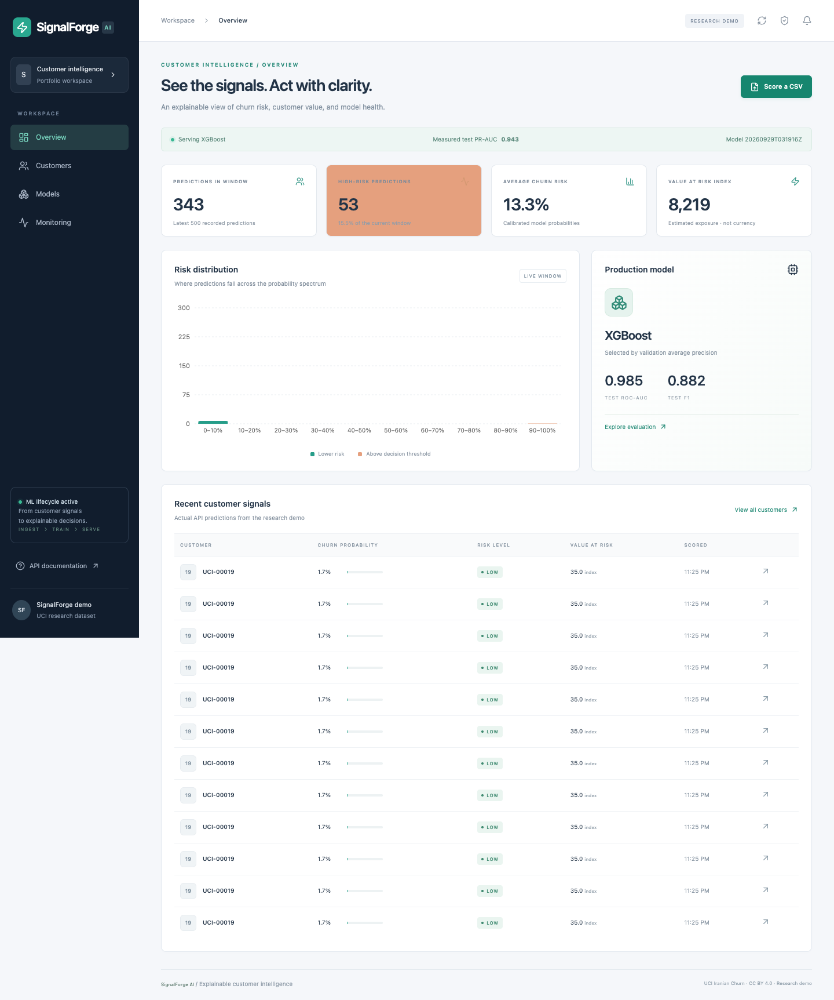

**Working software, measured results, explicit limits.** This research demo trains four model families, serves calibrated predictions, persists audit records, explains predictions with SHAP, executes Redis-backed jobs and detects simulated drift. No fabricated metrics, business savings or cloud deployment claims. The source provides a calculated customer-value index, not dollar revenue; “value at risk” is an exposure proxy, not a revenue forecast.

[Quick start](#run-locally) · [Measured results](#measured-ml-results) · [API](docs/API.md) · [Data contract](docs/DATA.md) · [MLOps](docs/MLOPS.md) · [Case study](docs/CASE_STUDY.md) · [Interview guide](docs/INTERVIEW_GUIDE.md)

## Product walkthrough

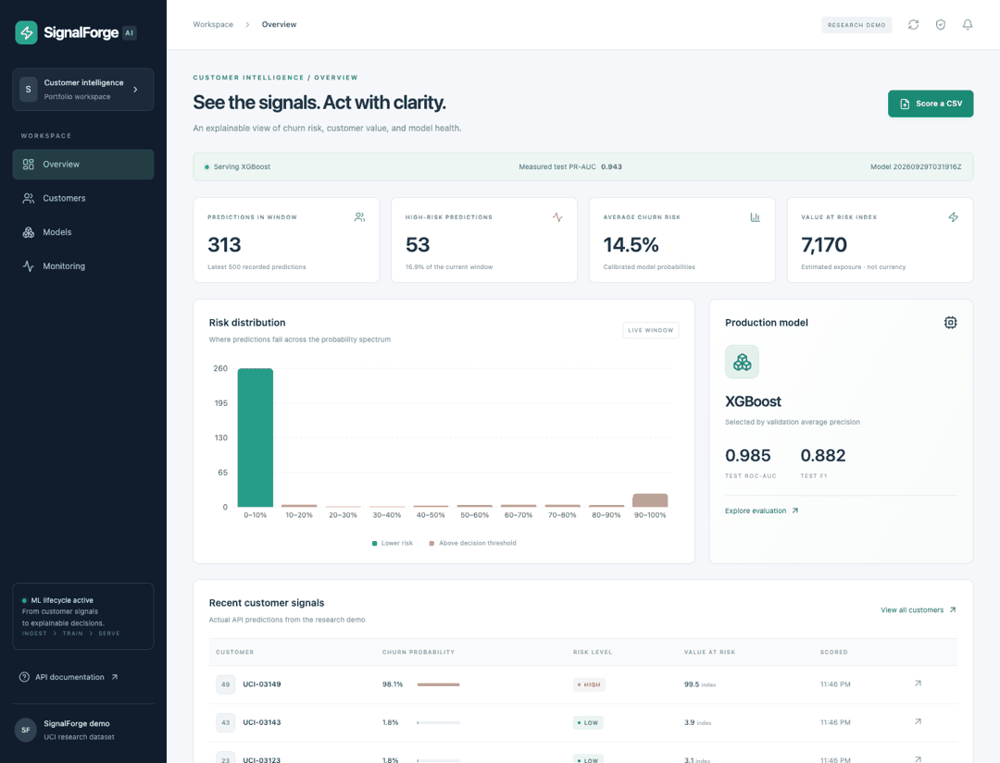

- **Overview:** live prediction window, calibrated risk distribution, value-index exposure and production model evidence.
- **Customers:** search/filter, prediction history, observed profile and approximate SHAP contributions in probability units.
- **Models:** four-family comparison, validation-based selection, test metrics, threshold and auxiliary regression.
- **Monitoring:** schema quality, PSI/KS distribution checks, delayed-label performance and saved snapshots.
- **CSV scoring:** validated upload and downloadable actual predictions. Redis/Celery handles queued work separately.

<details><summary>More actual screenshots</summary>

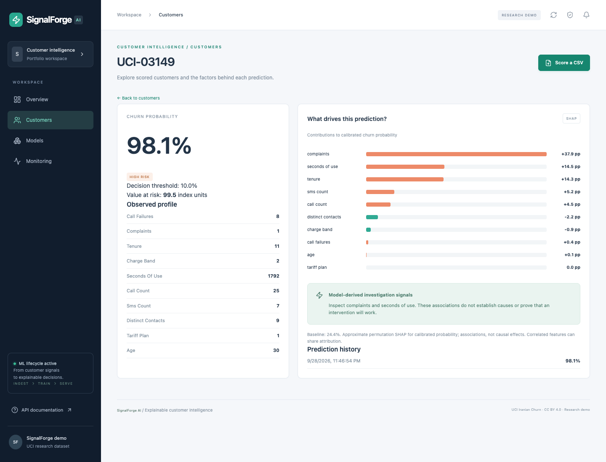
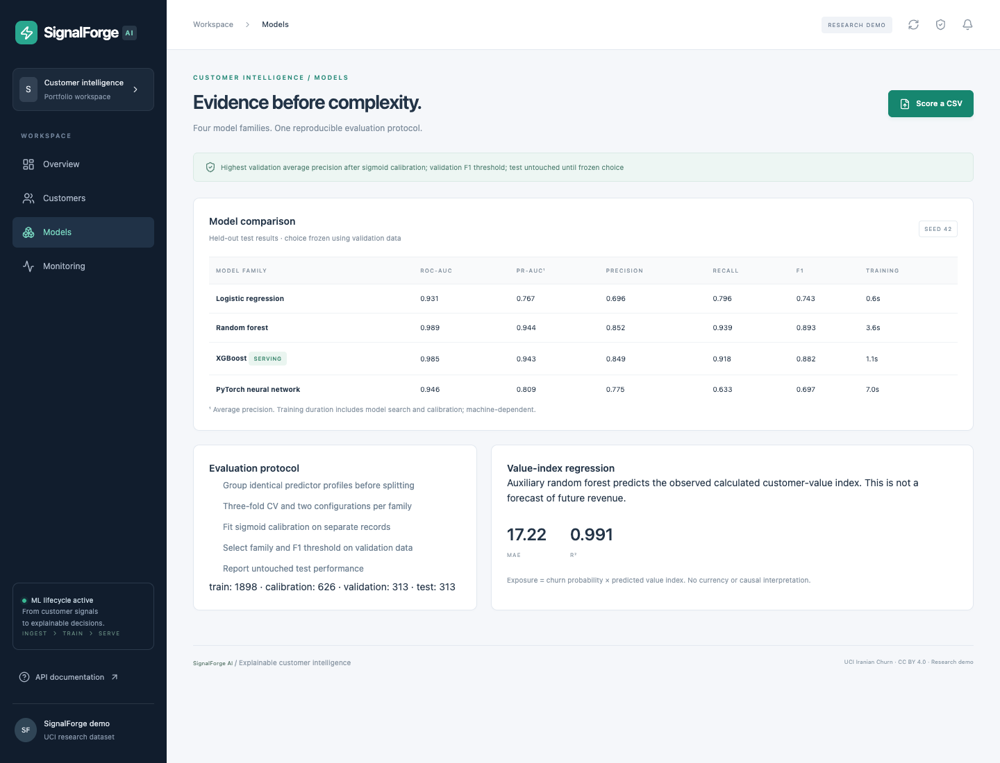
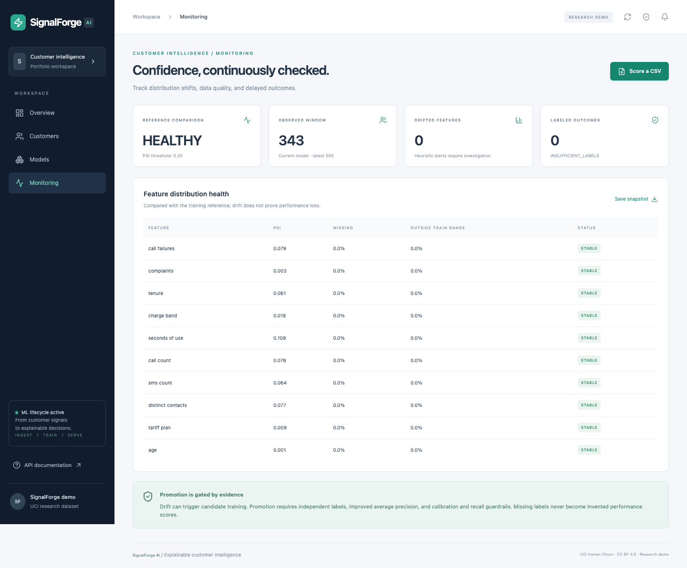

</details>

## Architecture

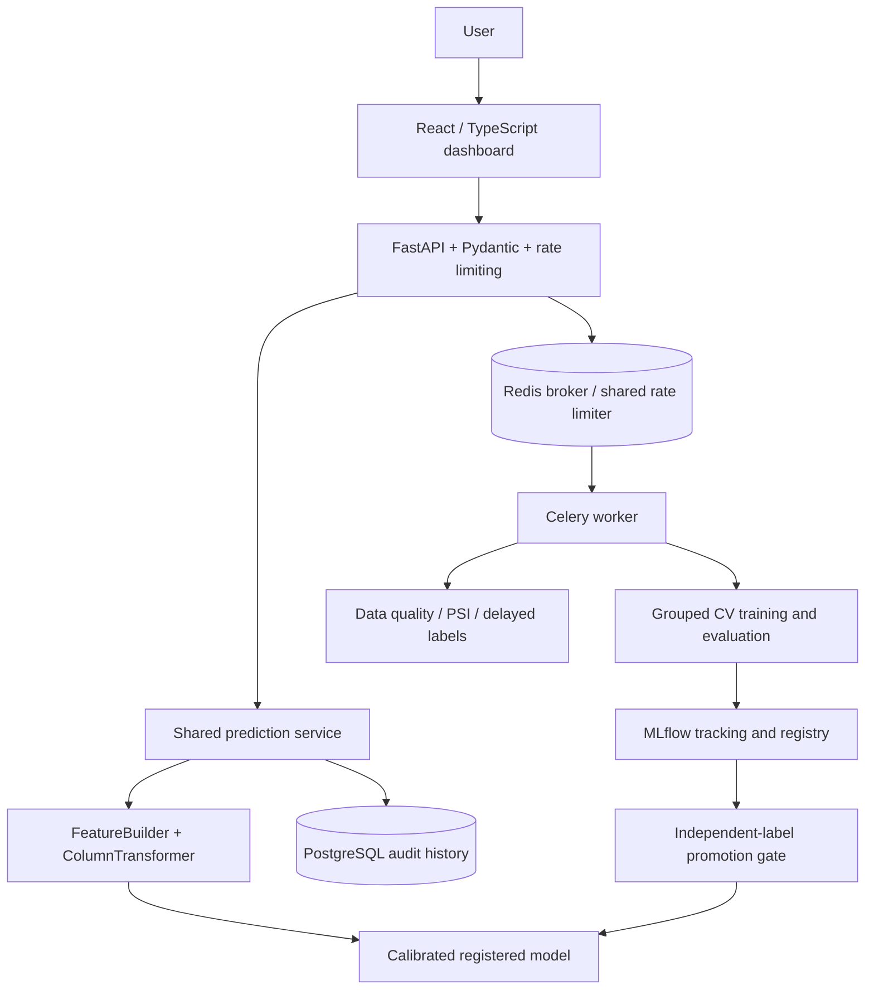

One feature/inference implementation serves CLI, HTTP and workers. Learned imputation, scaling and encoding live inside CV pipelines. SQLAlchemy and Alembic manage durable prediction/model/monitoring records. SQLite is an explicit lightweight local fallback; real PostgreSQL integration has been exercised. MLflow aliases record lifecycle state; serving consumes a versioned local bundle. [Engineering decisions and limitations](docs/ENGINEERING.md).

## Measured ML results

Data: **3,150 rows**, **15.71% churn**, 13 raw attributes; ten retained inputs plus five engineered ratios. [UCI Iranian Churn](https://archive.ics.uci.edu/dataset/563/iranian+churn+dataset), CC BY 4.0. The source documents nine months of observations followed by a three-month outcome gap. Full data is downloaded on demand; a 25-row attributed sample is included.

Split sizes: train **1898**, calibration **626**, validation **313**, test **313**. Exact duplicate predictor profiles remain within a partition. Three-fold grouped CV compares two parameter settings per family. Sigmoid calibration uses a separate partition. **Validation average precision selects the family; validation F1 selects the threshold (0.10).** Test data is inspected only after that decision is frozen.

| Model | Validation AP | Test ROC-AUC | Test AP | Precision | Recall | F1 | Fit/search s |
|---|---:|---:|---:|---:|---:|---:|---:|
| logistic | 0.7010 | 0.9312 | 0.7673 | 0.6964 | 0.7959 | 0.7429 | 0.64 |
| random_forest | 0.9340 | 0.9892 | 0.9437 | 0.8519 | 0.9388 | 0.8932 | 3.61 |
| xgboost **(selected)** | 0.9392 | 0.9852 | 0.9425 | 0.8491 | 0.9184 | 0.8824 | 1.05 |
| pytorch | 0.8278 | 0.9465 | 0.8087 | 0.7750 | 0.6327 | 0.6966 | 7.04 |

“AP” is average precision, often called PR-AUC; it is not trapezoidal PR area. XGBoost wins validation AP. Random Forest slightly outperforms it on the test set; selecting Random Forest after seeing that would misuse the test set. These results are one small historical-data split, not evidence of future customer impact. [Full machine-readable evidence](docs/results.json), [uncertainty and age slices](docs/uncertainty.json).

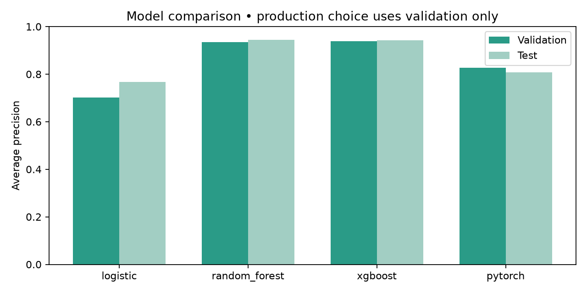

| ROC curve | Precision–recall curve |
|---|---|
| 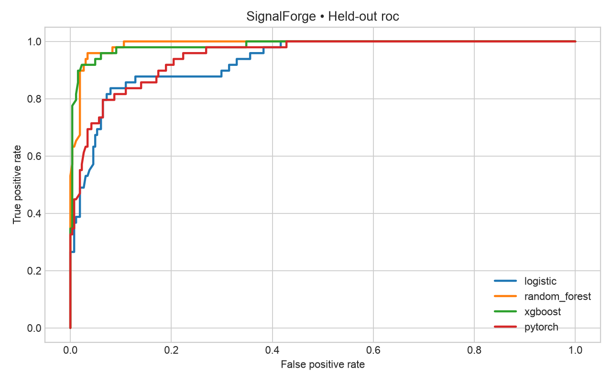 | 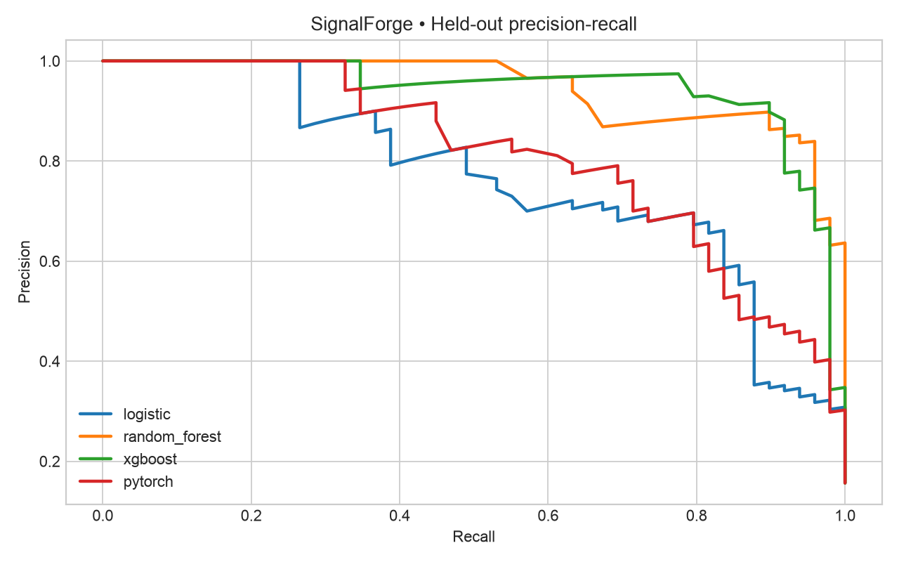 |

| Confusion matrix | Calibration |
|---|---|
| 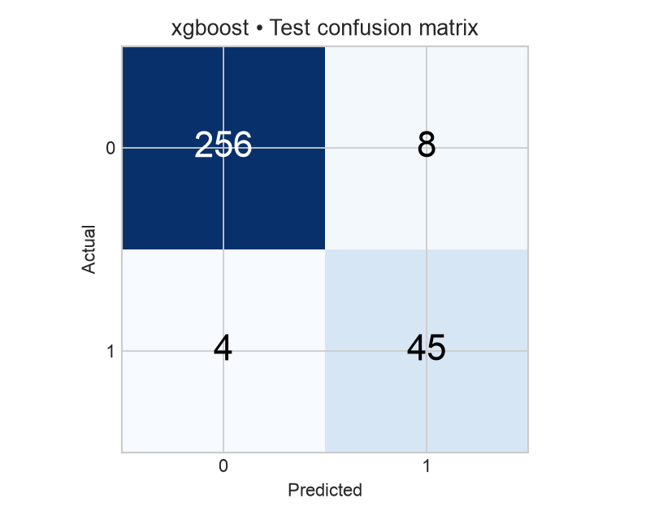 | 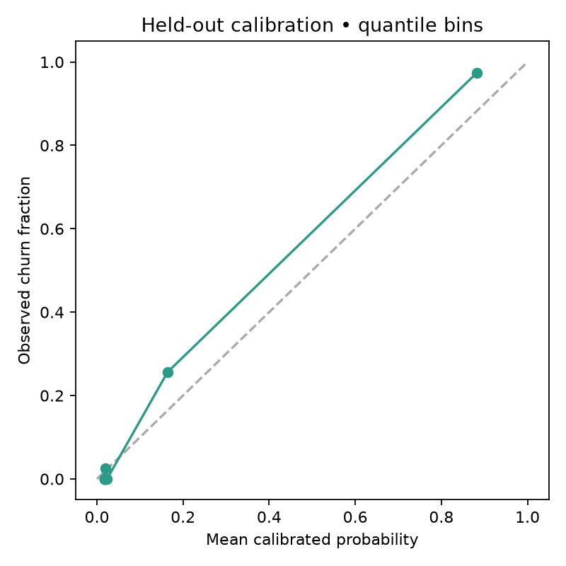 |

The auxiliary Random Forest regression predicts the **observed calculated value index**: MAE **17.22**, RMSE **49.78**, R² **0.9907**. This target is partly derived from behavior, so its fit is not proof of useful future-revenue forecasting. Exposure is calibrated churn probability × nonnegative predicted value index.

## Explanations and monitoring

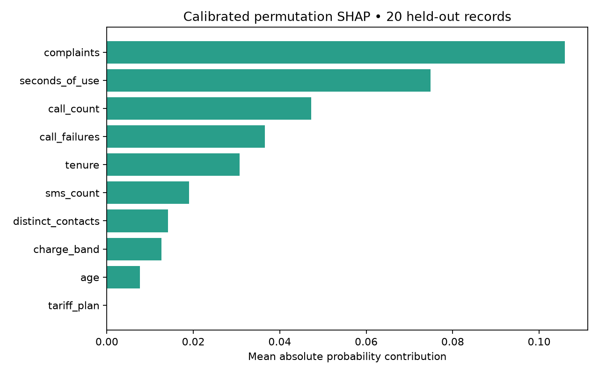

Permutation SHAP explains the whole calibrated pipeline using training-only background records. Both positive and negative contributions and feature values are exposed. Additivity is tested. The summary uses 20 held-out records and is a small descriptive sample; correlated features can share credit. Signals are associations, not causal business recommendations.

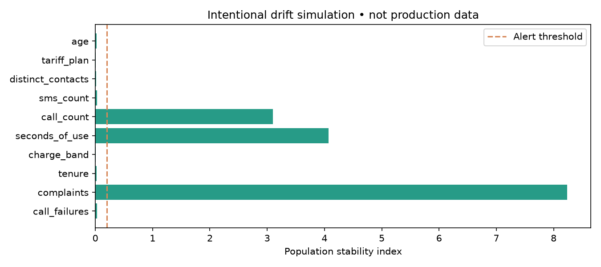

The deterministic drift script reduces usage and increases complaints: baseline **HEALTHY**, shifted data **ALERT** in the recorded run. Performance metrics require actual delayed labels. Retraining needs a disjoint labeled evaluation window and cannot promote a worse model merely because drift occurred. [Lifecycle and promotion policy](docs/MLOPS.md).

## Run locally

Prerequisites: **Python 3.12**, **Node 22**, Git. On macOS, XGBoost requires OpenMP (`brew install libomp`). Linux containers install `libgomp1`. The measured build used Python 3.12.14 on macOS-14.2.1-arm64-arm-64bit.

```sh
git clone https://github.com/Skeeb32/signalforge-ai.git
cd signalforge-ai
python3.12 -m venv .venv
source .venv/bin/activate
python -m pip install --upgrade pip
pip install -r requirements-lock.txt
pip install --no-deps -e .
python -m signalforge validate-data
python -m signalforge train
python -m signalforge promote
alembic upgrade head
uvicorn signalforge.api:app --host 127.0.0.1 --port 8000
```

In another terminal:

```sh
cd signalforge-ai/apps/web
npm ci
npm run dev
```

Open **http://localhost:5173**. From an activated Python terminal in the repository root, run `python scripts/seed_demo.py` to populate the dashboard with actual held-out predictions. API docs: **http://localhost:8000/docs**. With no environment overrides, persistence uses local SQLite. For PostgreSQL, set `DATABASE_URL` from `.env.example` before migrations and API startup; variables are environment-driven, not implicitly loaded from a file by the bare CLI.

```sh
# In a separate terminal, start the existing local MLflow tracking store
mlflow server --backend-store-uri sqlite:///mlflow.db --host 127.0.0.1 --port 5001
# For future remote-server runs, export MLFLOW_TRACKING_URI=http://localhost:5001
```

Training creates local artifacts and a candidate registry alias. The first `promote` bootstraps production; subsequent promotions intentionally require an independent evaluation window. You can evaluate or score without retraining:

```sh
python -m signalforge evaluate
python -m signalforge predict --input data/sample/customers.csv --output predictions.csv
python -m signalforge monitor --input data/processed/test.csv
python scripts/simulate_drift.py
python scripts/explain_report.py
python scripts/report_metrics.py
```

## Docker stack

```sh
cp .env.example .env
docker compose up --build
# Once API health passes:
docker compose exec api python scripts/seed_demo.py
```

Open **http://localhost:8080**. Compose launches web, API, PostgreSQL, Redis, MLflow and worker. The API migrates and trains on the first start only; allow dependency image build and initial training time. Named volumes retain datasets, model bundles, reports, database and tracking artifacts. Ports bind to loopback. Use `.env` values for Compose; bare CLI environment exports are separate.

API/web/worker Dockerfiles and Compose definitions are included. **Docker was not available on the development Mac; local full-stack execution used native PostgreSQL and Redis.** The CI container job builds images separately. See [validation status](docs/VALIDATION.md) for verified checks and any external blocks; do not infer that an unrun deployment has passed.

## Tests, checks and benchmarks

```sh
pytest --cov=signalforge
ruff check . && ruff format --check .
cd apps/web && npm run lint && npm run build && npm test
# Running API required for HTTP benchmark:
python scripts/benchmark.py  # from repository root
```

Tests cover leakage boundaries, fold-local preprocessing, input validation, artifact reload/probability range, SHAP additivity, promotion regressions, drift behavior, CSV boundaries, authentication and actual database roundtrips. [Validation](docs/VALIDATION.md) distinguishes unit/integration results from unrun paths. CI runs Python, PostgreSQL/Redis, frontend, container and dependency/secret checks.

Measured warm local single-process benchmark: inference p50 **22.05 ms** / p95 **22.61 ms**; HTTP including PostgreSQL persistence p50 **29.43 ms** / p95 **47.98 ms**. One 313-row in-process batch: **7,959 rows/s**. Not a concurrent load test or a service capacity guarantee. [Methodology and all numbers](docs/BENCHMARKS.md).

## Repository map

```text
src/signalforge/       reusable ingestion, features, training, serving and lifecycle
apps/web/             React + TypeScript + Tailwind/Recharts dashboard
apps/api/, worker/    container entry points
scripts/              real drift, SHAP, seed, benchmark and queue checks
alembic/              PostgreSQL / SQLite schema migrations
tests/                unit, ML and integration contracts
notebooks/            executed EDA and evaluation (not production logic)
data/sample/          small attributed public-data sample
infrastructure/       optional Terraform AWS foundation
docs/                 results, screenshots, architecture and portfolio guides
```

## AWS, security and next steps

The optional architecture uses private Fargate services, ECR, S3 model artifacts, RDS, Redis, MLflow, CloudWatch and an HTTPS/OIDC edge. Terraform validates the foundation; **nothing is deployed or billed by this project**. [AWS scope, costs and deployment runbook](docs/AWS.md).

The demo implements schema validation, bounded CSV/batches, optional constant-time API-key checks, CORS, rate limiting, dependency audits and non-root containers. It does not implement enterprise OIDC, RBAC, tenancy, compliance or complete privacy retention controls. Keep it local until those are added. [Security policy](SECURITY.md).

Next: temporal event data; truly independent retraining labels; cost-sensitive threshold analysis; calibrated confidence intervals across splits; fairness audits; idempotent queue delivery; artifact signing; OIDC/RBAC; canary release and distributed promotion; concurrent load testing; cloud restore/rollback drills. [Case study](docs/CASE_STUDY.md), [resume bullets](docs/RESUME_BULLETS.md), [interview talking points](docs/INTERVIEW_GUIDE.md).

## Contributing and licensing

[Contributing](CONTRIBUTING.md) · [Code of conduct](CODE_OF_CONDUCT.md) · [Changelog](CHANGELOG.md). Code: MIT. UCI dataset/sample: CC BY 4.0, attribution in [DATA.md](docs/DATA.md). Screenshots are captured from this running implementation; plotted values come from recorded experiments.
