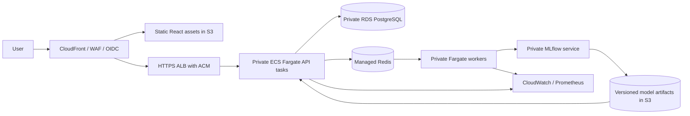

# Optional AWS deployment architecture

**Designed and Terraform-validated; not deployed or load-tested on AWS.** Local evidence is not AWS performance evidence.

The included Terraform module provisions the **foundation**: ECR, encrypted private/versioned S3, ECS cluster, logs, IAM model-read role, private RDS and security groups. It expects an existing VPC and private subnets. It does not provision the ALB, CloudFront, Redis, MLflow or ECS application services; these require account-specific networking, certificate and authentication decisions.

Deployment procedure:
1. Run the clean-checkout tests and review the Terraform plan. Use a private encrypted/locked remote state backend.
2. Build immutable API/worker and web image tags; push to the returned ECR repositories. Pin deployment to image digests.
3. Store the database URL, API bootstrap key and Redis credentials in Secrets Manager. Use a least-privilege application database role, not the RDS administrator.
4. Run Alembic once as a release task. Do not run competing migrations in every replica.
5. Run training as a separate task. Store approved, trusted artifacts under versioned S3 keys, including hashes and evaluation evidence. A deployment bootstrap should fetch and verify the approved bundle before serving. The local Compose startup trains for convenience; do not use that behavior in production replicas.
6. Create private ECS services for API, workers and MLflow, with task-scoped IAM, read-only runtime filesystems where possible, writable scratch volumes, Secrets Manager injection, health checks and rolling deployment circuit breakers. Serve web assets through S3/CloudFront or the supplied Nginx image.
7. Put the API behind an HTTPS ALB and an OIDC authentication gateway. Restrict RDS and Redis ingress to task security groups; configure private outbound access with endpoints or reviewed NAT routes.
8. Collect logs without raw customer profiles. Add latency/error, queue-age, failure, drift, label-lag and calibration alerts. Enable backups and test restore/rollback.
9. Canary a model version before changing production; roll back by redeploying the prior immutable artifact version.

Cost considerations: Fargate vCPU/memory hours, ALB hours/LCUs, RDS instance/storage/backups, Redis, NAT gateways, S3 requests/storage, ECR storage and log ingestion all contribute. NAT, RDS and always-on services often dominate a tiny demo. No dollar quote or savings claim is made because no regional configuration was priced or deployed. Use the AWS Pricing Calculator for the chosen region; set budgets and shut down unused demo services.

References: [ECS network security](https://docs.aws.amazon.com/AmazonECS/latest/developerguide/security-network.html), [AWS private Fargate pattern](https://docs.aws.amazon.com/prescriptive-guidance/latest/patterns/access-container-applications-privately-on-amazon-ecs-by-using-aws-fargate-aws-privatelink-and-a-network-load-balancer.html).
