# Lifecycle and promotion policy

```mermaid
flowchart LR
  D[Versioned data] --> V[Schema validation]
  V --> F[Grouped splits and fold-local features]
  F --> T[Four-family CV search]
  T --> C[Separate sigmoid calibration]
  C --> E[Validation family and threshold selection]
  E --> R[MLflow candidate alias]
  R --> G[Independent labeled-window gate]
  G --> P[Production alias and versioned local bundle]
  P --> I[API and batch inference]
  I --> M[Quality / PSI / delayed labels]
  M -->|Significant drift and labels| T
```



MLflow logs model type through run name, hyperparameters, seed, dataset hash, feature version, training duration, validation metrics, fitted model and final evaluation metadata/figures. The selected registered model receives `candidate`; promotion updates `production`, preserving the prior registry version under `archived`. Aliases are the modern alternative to fixed registry stages ([MLflow documentation](https://www.mlflow.org/docs/latest/ml/model-registry/workflow/)).

Serving uses a trusted local bundle of the registered model, value regressor, metadata and reference/background data. It does not download an alias on each request. Versioned directories plus an atomic symlink switch allow new requests to notice changed metadata and reload. Local artifacts and registry aliases are two systems, not a distributed transaction: production deployment should use an explicit release controller with reconciliation and canary rollback. Never accept uploaded pickle/joblib artifacts.

Initial promotion is a documented bootstrap. Every later promotion requires at least 100 independently labeled evaluation rows with both classes, average precision improvement of at least 0.005, Brier score degradation no greater than 0.005, and recall degradation no greater than 0.02. Thresholds are kept at each model's validation-selected value. The retraining command rejects evaluation profiles shared with candidate or champion training data. Evaluation data must also be organizationally held out from tuning; dataset overlap checks alone cannot enforce that.

```sh
python -m signalforge train --input data/raw/churn.csv
python -m signalforge promote
python -m signalforge retrain --input /path/to/new-labeled-training.csv --evaluation /path/to/independent-labeled-window.csv
```

Retraining checks drift first, trains all four candidate families only when significant drift exists, then applies the gate. Without trustworthy labels it refuses promotion. Celery exposes `retrain_job(training_path, evaluation_path)` for scheduler integration, while `run_monitoring` and `batch_predict` are working queued jobs. Jobs accept controlled operator file paths, not public arbitrary-path HTTP endpoints. The included queue check executes real batch and monitoring tasks. The static public dataset supplies no new independent production window; an actual newer-model promotion is therefore not claimed.

Monitoring compares a current-model window (up to 500 recent predictions) with the training reference. It reports missing columns, missing rates, unexpected categorical values, out-of-reference ranges, PSI and KS statistics/p-values. PSI > 0.2 is a heuristic alarm; KS is descriptive and is not used as an uncorrected multiple-testing trigger. Small windows are noisy. Delayed labels attach to a prediction ID; precision, recall, F1, ROC-AUC, Brier and log loss are calculated only when two classes are observed. Outcomes for different model versions are not pooled.

```sh
python scripts/simulate_drift.py
python -m signalforge monitor --input data/processed/drift-simulation.csv
celery -A signalforge.tasks worker --loglevel=INFO --concurrency=1
python scripts/check_queue.py
```

The simulation deliberately reduces call volume/duration and sets complaints to one. It is clearly labeled simulation; it is not claimed as observed production drift. Prediction volume is an event count, not unique customers, and value exposure summed over repeated events is not unique-account revenue risk. Prometheus exposes HTTP request count and latency; persist snapshots using `/monitoring/run`.

Operational improvements: idempotency keys for at-least-once Celery delivery, distributed promotion locks, a separate label service, production performance alerts with minimum sample sizes, tenant isolation, retention/deletion policy and model/data lineage signed manifests.

## Optional scheduler

`docker compose --profile automation up --build` starts Celery Beat with an hourly review. The task persists monitoring and queues retraining only when drift is significant and both `RETRAIN_DATA_PATH` and `RETRAIN_EVALUATION_PATH` are operator-configured paths on the shared data volume. Run one scheduler and one training worker; distributed training/promotion locks are future work. The worker environment must see the same files. Repeated windows still must pass the independent-label gate; the absence of new labeled data is an intentional stop condition.
